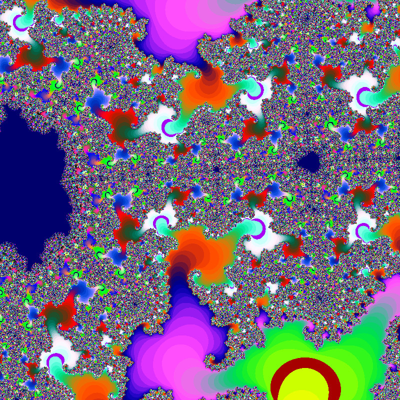
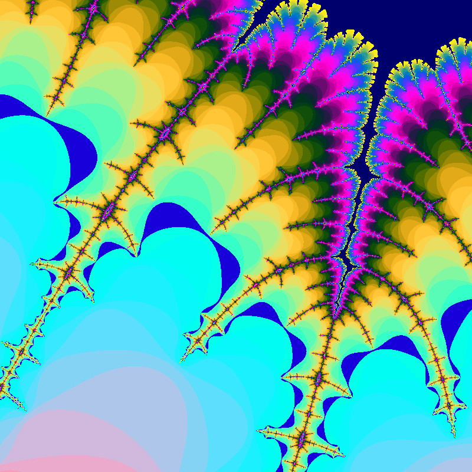
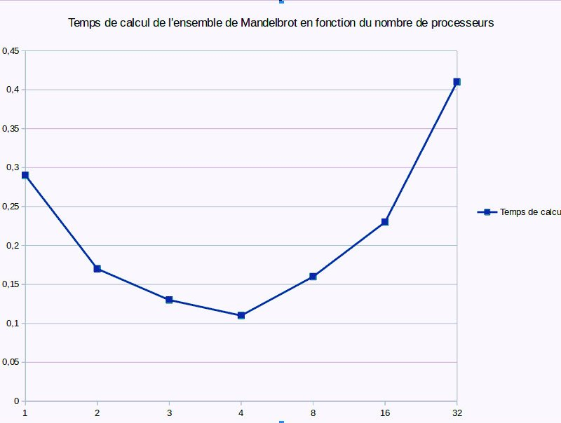
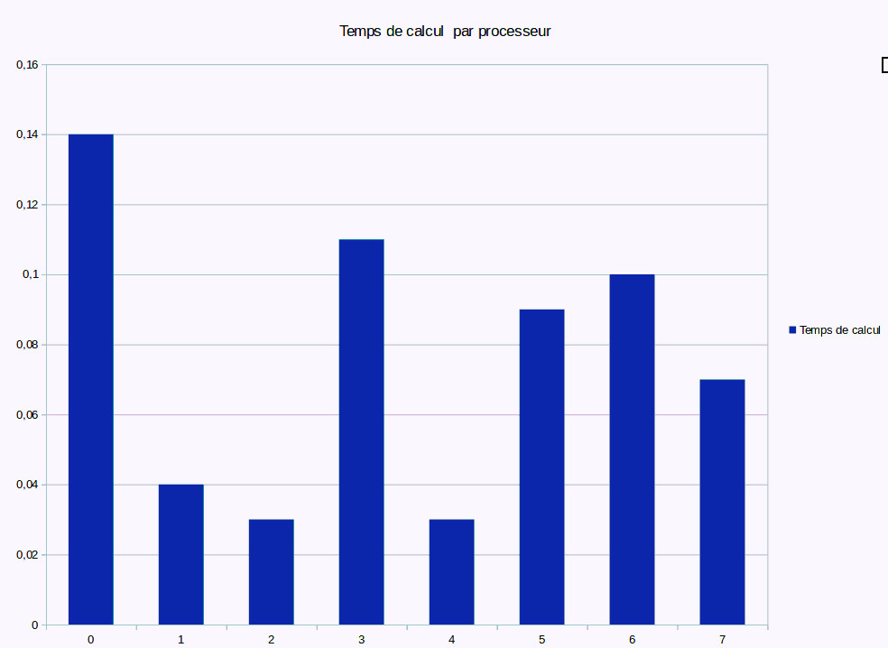

# Programmation Parallèle

Rapport d'Arnaud Grégoire

# TD/TP1 Ensemble de Mandelbrot

### Ensemble de MandelBrot

En mathématiques, "l'ensemble de Mandelbrot est une fractale définie comme l'ensemble des points c du plan complexe pour lesquels la suite de nombres complexes définie par récurrence par :

{ z 0 = 0 z n + 1 = z n 2 + c {\displaystyle {\begin{cases}z_{0}=0\\z_{n+1}=z_{n}^{2}+c\end{cases}}} \begin{cases} z_0=0\\ z_{n+1}=z_n^2+c \end{cases}

est bornée.

L'ensemble de Mandelbrot a été découvert par Gaston Julia et Pierre Fatou1 avant la Première Guerre mondiale. Sa définition et son nom actuel sont dus à Adrien Douady, en hommage aux représentations qu'en a réalisées Benoît Mandelbrot dans les années 1980. Cet ensemble permet d'indicer les ensembles de Julia : à chaque point du plan complexe correspond un ensemble de Julia différent. Les points de l'ensemble de Mandelbrot correspondent précisément aux ensembles de Julia connexes, et ceux en dehors correspondent aux ensembles de Julia non connexes. Cet ensemble est donc intimement lié à l'ensemble de Julia, ils produisent d'ailleurs des formes similairement complexes.

Les images de l'ensemble de Mandelbrot sont réalisées en parcourant les nombres complexes sur une région carrée du plan complexe et en déterminant pour chacun d'eux si le résultat tend vers l'infini ou pas lorsqu'on y itère une opération mathématique. On considère la partie réelle et imaginaire de chaque nombre complexe comme des coordonnées et chaque pixel est coloré selon la rapidité de divergence, ou si elle ne diverge pas.

Les images de l'ensemble de Mandelbrot exposent une limite élaborée qui révèle progressivement des détails récursifs toujours plus fins en augmentant le grossissement. La limite de l'ensemble est constituée de plus petites versions de la forme principale, donc la propriété fractale de l'autosimilarité s'applique à l'ensemble tout entier (et pas simplement à certaines parties)." Wikipedia.

### Compilation

Pour compiler le code, on fait la commande

```sh
make mandel
```

Cette commande appelle un makefile qui fera la commande suivante 

```sh
mpicc mandel.c -o mandel -lm
```

### Exécution

Pour éxécuter le code, on réalise la commande :

```sh
mpirun -np [nb_processus] mandel [paramètres]
```

### Calcul séquentiel & choix techniques

On représente l'image comme un tableau à 1 dimension de longeur w\*h (avec w et h la largeur et la hauteur en pixels de l'image). Etant donné que l'on stocke chaque valeur de pixel sur 1 octet (type char), on alloue donc une mémoire de w\*h\*sizeof(char).

Pour parcourir ce tableau, et afin de rendre compte de l'aspect spatial de l'ensemble de mandelbrot, on réalise 2 boucles imbriquées sur la largeur et la hauteur. Le calcul est réalisé à chaque pixel de l'image en fonction des coordonnées x et y de ce pixel, calculées à l'aide d'un incément à partir des coordonnées minimales. L'incrément dépend des limites de domaine (x mi et max, y min et max) et de la résolution de l'image.

Enfin, le paramètre profondeur correspond à la profondeur de calcul de la valeur de l'ensemble de mandelbrot à chaque pixel.


### Calcul parallèle

On a dit plus haut qu'il fallait optimiser les étapes dépendant de la résolution et de la profondeur. Pour cette dernière il s'agit de la fonction qui calcule la valeur de l'ensemble de mandelbrot à une position donnée. Cependant, chaque itération de cette fonction dépend de la précédente. On ne peut donc pas la parralèliser.

On se contentera donc de parallèliser le parcours du tableau correspondant à l'image, dont les itérations sont totalement indépendantes.

### Algorithme 1 : Calcul de l'ensemble du Mandelbrot en charge statique-Maitre

Paramètres : 

 - my_rank : rang du processeur
 - H_loc : longeuer de l'image locale
 - H : longueur de l'image
 - Xmin
 - Xinc
 - Ymin_loc
 - Yinc

Sortie : Calcul traité par le maître avec positionnement du pointeur au début de son image locale et allocation dynamique de l'image globale.

```c
  MPI_Status status;
  int rank;
  int nb_proc;
  MPI_Init(&argc, &argv);
  MPI_Comm_rank(MPI_COMM_WORLD, &rank);
  MPI_Comm_size(MPI_COMM_WORLD, &nb_proc);
  
  printf("Processeur : %d\n", rank);

  int bloc_size = (h/nb_proc)*w;
  int h_tmp = h/nb_proc;
  if(rank == MASTER){
    /* Allocation memoire du tableau resultat */  
    pima = ima = (unsigned char *)malloc(w*h*sizeof(unsigned char));
  }else{
    pima = ima = (unsigned char *)malloc(bloc_size*sizeof(unsigned char));
  }
    
  if( ima == NULL) {
    fprintf( stderr, "Erreur allocation mémoire du tableau \n");
    return 0;
  }

  double ymin_loc = ymin + rank*yinc*h_tmp;
  y = ymin_loc; 
  for (i = 0; i < h_tmp; i++) { 
    x = xmin;
    for (j = 0; j < w; j++) {
      *pima++ = xy2color( x, y, prof);
      x += xinc;
    }
    y += yinc; 
  }

  if(rank == MASTER){
    printf("RECEPTIONS POUR %d PROCESSEURS\n", nb_proc);
    for(int k = 1; k < nb_proc; k++){
      MPI_Probe(MPI_ANY_SOURCE, 99, MPI_COMM_WORLD, &status);
      int s = status.MPI_SOURCE;
      printf("SOURCE : %d\n",s);
      if(s != 0){
        MPI_Recv(ima+w*h_tmp*s, w*h_tmp, MPI_CHAR, s, 99, MPI_COMM_WORLD, &status);
      }
    }

```

## Résultats Obtenus

Commande lancé : 

```sh

mpirun -np 2 mandel 800 800 -0.736 -0.184 -0.735 -0.183 500

0.735 -0.183 500
Domaine: {[-0.736,-0.184]x[-0.735,-0.183]}
Increment : 1.25156e-06 1.25156e-06
Prof: 500
Dim image: 800x800
Domaine: {[-0.736,-0.184]x[-0.735,-0.183]}
Increment : 1.25156e-06 1.25156e-06
Prof: 500
Dim image: 800x800
1.20747
Temps total de calcul : 1.20747 sec
Temps total de calcul : 1.21253 sec
1.21253
```



Si j'augmente les dimensions de l'image 800x800 => 2500x2500 on a :

```sh
mpirun -np 2 mandel 2500 2500 -0.736 -0.184 -0.735 -0.183 500

 -0.735 -0.183 500
Domaine: {[-0.736,-0.184]x[-0.735,-0.183]}
Increment : 4.0016e-07 4.0016e-07
Prof: 500
Dim image: 2500x2500
Domaine: {[-0.736,-0.184]x[-0.735,-0.183]}
Increment : 4.0016e-07 4.0016e-07
Prof: 500
Dim image: 2500x2500
11.7508
Temps total de calcul : 11.7508 sec
Temps total de calcul : 11.7655 sec
11.7655
```


On voit donc que le temps de calcul évolue linéairement en fonction du nombre de pixels à calculer.

### Effets de la parallélisation

On réalise la représentation de l'image de l'ensemble de Mandelbrot suivant :



On cherche à déterminer le lien entre le nombre de processeurs et le temps de calcul

 - 1 processeur

```sh
mpirun -np 1 mandel 800 800 -1.48478 0.00006 -1.48440 0.00044 100
Temps total de calcul : 0.295458 sec
```

 - 2 processeurs

```sh
mpirun -np 2  mandel 800 800 -1.48478 0.00006 -1.48440 0.00044 100
Temps total de calcul : 0.179266 sec
```

 - 3 processeurs

```sh
mpirun -np 3  mandel 800 800 -1.48478 0.00006 -1.48440 0.00044 100
Temps total de calcul : 0.139356 sec
 ```

 - 4 processeurs

```sh
mpirun -np 4 mandel 800 800 -1.48478 0.00006 -1.48440 0.00044 100
Temps total de calcul : 0.117159 sec
```

 - 8 processeurs 

```sh
mpirun -np 8 mandel 800 800 -1.48478 0.00006 -1.48440 0.00044 100
Temps total de calcul : 0.165076 sec
``` 

 - 16 processeurs

```sh
mpirun -np 16 mandel 800 800 -1.48478 0.00006 -1.48440 0.00044 100
Temps total de calcul : 0.233506 sec
``` 

 - 32 processeurs

```sh
mpirun -np 32 mandel 800 800 -1.48478 0.00006 -1.48440 0.00044 100
Temps total de calcul : 0.413134 sec
``` 


On obtient le graphique suivant :



On remarque que le temps de calcul est minimal pour 4 processeurs, ce qui correspond au nombre de processeurs rééllement présent sur la machine.

### Temps de calcul par processeurs

On cherche à déterminer le temps de calcul pour chaque processeur. On prend ici un exemple avec 8 processeurs, le proceseur n° 0 étant le maitre (celui qui réceptionne tous les paquets).

On obtient le graphique suivant

  

On remarque que le plus grand temps de calcul est sur le processus numéro 0, c'est à dire le processus master. En effet, on peut s'attendre à ce que ce soit ce processus qui soit le plus utilisé.

# TD/TP2 : Convolution

## Question 1

On utilise un tampon intermédiaire pour appliquer un filtre de convolution sur les valeurs de l'image et non pas sur les valeurs des filtres de convolutions réalisés précédemment.s


## Question 2

La convolution de chaque pixel de l'image par un filtre est indépendante du produit de convolution des valeurs des pixels voisins. On peut donc parralléliser l'ensemble des calculs des filtres de convolutions.

## Question 3

Pour un noyau de taille 3x3, on a 9 multiplications et 8 additions, on a alors O(9+8) = O(17) = O(1) par pixel => cela veut dire que le nombre d'opérantions étant constant pour tous les pixels de l'image => le nombre d'opérations est constant quelque soit la valeur du pixel => équilibrage de la charge statique

## Question 4

La répartition des données par bloc semble naturel dans ce contexte.

## Question 5

Sachant que l'on exclut les pixels des bords à chaque itération, la dimension N de l'image au bout de i itérations sera de N - 2i.

## Question 6 Tableau de performance

Nombre de threads | Temps(s) | Accélération | Efficacité
--- | --- | --- | ---
1   | 6.23 | 1 131 | 1
2   | 3.23 | 1,131 | 0,957
4   | 1.23 | 3,131 | 0,911
7   | 1.23 | 5,131 | 0,809
14  | 0.23 | 8,131 | 0,613
25  | 0.23 | 10,131 | 0,401
28  | 0.23 | 10,131 | 0,37
50  | 1.23 | 4,131 | 0,092
100 | 3.23 | 1,131 | 0,017


# TD/TP3 : OpenMP

## Question 1 

Le nombre de coeurs disponibles sur la machine est 4. 

```sh
cpu cores : 4
```

## Question 2 

On modifie le code pour paralléliser les boucles for imbriqués.

```c
  #pragma omp parallel for ordered schedule(dynamic) 
  for (i = 0; i < h; i++) { 
    x = xmin;
    #pragma omp parallel for ordered schedule(dynamic)
    for (j = 0; j < w; j++) {
      // printf("%d\n", xy2color( x, y, prof));
      // printf("(x,y)=(%g;%g)\t (i,j)=(%d,%d)\n", x, y, i, j);
      *pima++ = xy2color( x, y, prof); 
      x += xinc;
    }
    y += yinc; 
  }
```


On compile le fichier mandel.c avec différentes options :
```sh
gcc mandel.c -o mandelOMP -fopenmp -lm
```


On teste si l'effet de la parallélisation sur le temps de calcul : 
```sh
export OMP_NUM_THREADS=1
./mandelOMP

Temps total de calcul : 4.32283 sec

export OMP_NUM_THREADS=4
./mandelOMP

Temps total de calcul : 0.441621 sec
```

Le temps d'éxécution est effectivement réduit.

## Question 3


On veut changer le type d'équilibrage de charges en statique, on modifie dynamique en statique
```c
#pragma omp parallel for private(j, y, x, pima) ordered schedule(dynamic)
```
en
```c
#pragma omp parallel for private(j, y, x, pima) ordered schedule(static)
```

Pour faire varier la taille de bloc, on procède comme suit :
```c
#pragma omp parallel for private(j, y, x, pima) ordered schedule(dynamic, taille_bloc)
```

### Comparaison des types d'équilibrages

Avec OMP_NUM_THREADS = 4
dynamic : Temps total de calcul : 1.12535 sec
static : Temps total de calcul : 2.14522 sec

L'équilibrage statique diminue presque par 2 le temps de calcul comparé à l'équilibrage dynamique.


### Question 4

On modifie légèrement le programme séquentiel de convolution au niveau de la boucle à paralléliser avec des directives openMP :

```c
  #pragma omp parallel 
  { 
    #pragma omp for private(j) schedule(auto)    
    /* on laisse tomber les bords */
    for(i=1 ; i<nbl-1 ; i++) {
      for(j=1 ; j<nbc-1 ; j++){
        tmp[i*nbc+j] = filtre(
            choix,
            tab[(i+1)*nbc+j-1],tab[(i+1)*nbc+j],tab[(i+1)*nbc+j+1],
            tab[(i  )*nbc+j-1],tab[(i)*nbc+j],tab[(i)*nbc+j+1],
            tab[(i-1)*nbc+j-1],tab[(i-1)*nbc+j],tab[(i-1)*nbc+j+1]);
      } /* for j */
    } /* for i */
  }
```

On compile avec la commande :
```sh
$ gcc convol.c -o convolOMP -fopenmp -lm
```

On teste l'efficacité de la parallélisation comme suit :
```sh
$ export OMP_NUM_THREADS=1
$ ./convolOMP Albert-Einstein.ras 0 10

Temps total de calcul : 0.338399 seconde(s)

$ export OMP_NUM_THREADS=4
$ ./convolOMP Albert-Einstein.ras 0 10

Temps total de calcul : 0.107674 seconde(s)
```


Visiblement, cela fonctionne.

### Comparaison static/dynamic

Avec OMP_NUM_THREADS=4

dynamic : Temps total de calcul : 0.085149 seconde(s) 
static : Temps total de calcul : 0.095119 seconde(s) 

Le changement d'équilibrage statique/dynamique ne change pas le temps de total de calcul 


### Tableau de performance

Nombre de threads | Temps(s) | Accélération | Efficacité
--- | ---   | ---   | ---
1   | 2,98  | 1     | 1
2   | 1,502 | 1,984 | 0,992
4   | 0,889 | 3,352 | 0,838
8   | 0,897 | 3,322 | 0,415
16  | 0,852 | 3,498 | 0,219
32  | 0,842 | 3,539 | 0,111
64  | 0,835 | 3,569 | 0,056
128 | 0,837 | 3,560 | 0,028
256 | 0,843 | 3,535 | 0,014
